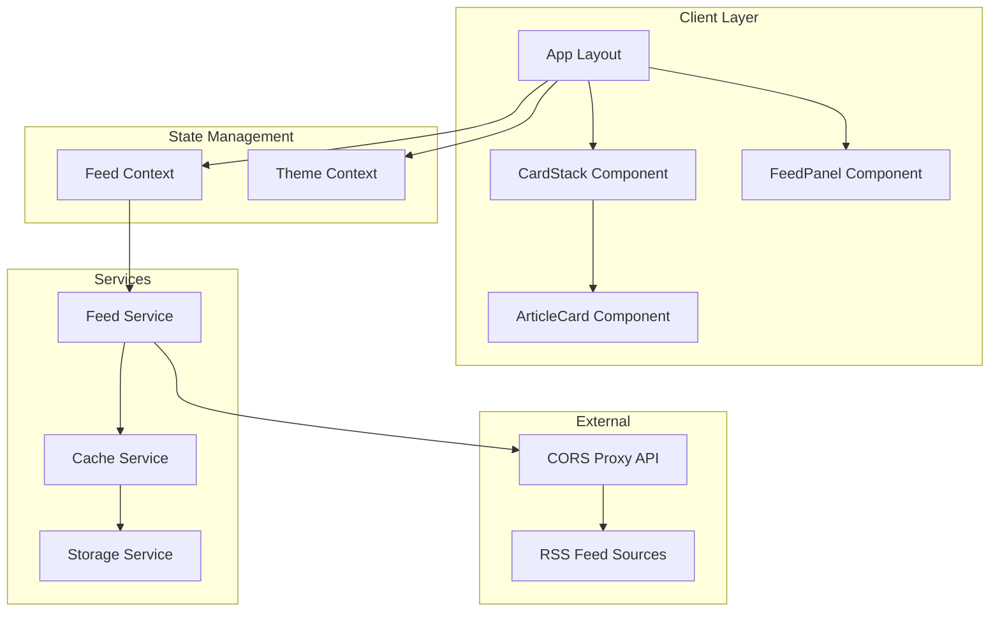

# Design Document: RSS-Tok

## Overview

RSS-Tok is a Next.js web application that transforms traditional RSS feeds into a modern, TikTok-style vertical scrolling experience. The application uses React 19 with Tailwind CSS 4 for styling, providing a responsive, visually engaging interface for consuming RSS content.

The core experience centers on full-screen article cards that users can swipe or scroll through vertically, with each card featuring a background image, article title, full content reading capability, and action buttons. The application loads a default feed (Reddit Technology) immediately on startup, ensuring users see content without any configuration. Users can like, save, and track read articles, view statistics, and mix multiple RSS feeds into a single randomized stream.

## Architecture



### Technology Stack

- **Framework**: Next.js 15 (App Router)
- **UI Library**: React 19
- **Styling**: Tailwind CSS 4
- **RSS Parsing**: rss-parser library
- **Data Fetching**: SWR for caching and revalidation
- **State Management**: React hooks (useState, useCallback)
- **Storage**: localStorage for caching, preferences, and user data
- **Icons**: lucide-react
- **Testing**: Vitest + fast-check for property-based testing (planned)

## Components and Interfaces

### Component Hierarchy

```
app/
├── layout.js              # Root layout with providers
├── page.js                # Main page with view management
├── globals.css            # Global styles and animations
├── components/
│   ├── CardStack.jsx      # Main feed vertical scroll container
│   ├── SavedCardStack.jsx # Saved articles view
│   ├── LikedCardStack.jsx # Liked articles view
│   ├── ArticleCard.jsx    # Individual article card with full content
│   ├── FeedPanel.jsx      # Feed discovery panel with tabs
│   ├── FeedInput.jsx      # URL input form
│   ├── FeedButton.jsx     # Feed selection button
│   ├── ProgressIndicator.jsx  # Position indicator
│   ├── SkeletonCard.jsx   # Loading placeholder
│   ├── ThemeToggle.jsx    # Dark/light mode toggle
│   ├── InfoModal.jsx      # About/info modal
│   └── StatsModal.jsx     # Statistics modal
├── hooks/
│   ├── useAppState.js     # App state management
│   ├── useFeed.js         # Feed fetching with SWR
│   └── useTheme.js        # Theme management
├── lib/
│   ├── storage.js         # localStorage utilities
│   └── validation.js      # URL validation
└── api/
    └── feed/
        └── route.js       # RSS feed parsing API
```

### Component Interfaces

#### CardStack
```typescript
interface CardStackProps {
  articles: Article[];
  currentIndex: number;
  onIndexChange: (index: number, articleLink: string) => void;
  isLoading: boolean;
  total: number;
  onRefresh: () => void;
}
```

#### ArticleCard
```typescript
interface ArticleCardProps {
  article: Article;
  isActive: boolean;
}
```

#### FeedPanel
```typescript
interface FeedPanelProps {
  isOpen: boolean;
  onClose: () => void;
  onFeedSelect: (urlOrUrls: string | string[]) => void;
  isLoading: boolean;
  selectedFeeds: string[];
  onToggleFeed: (url: string) => void;
  onClearSelection: () => void;
  onSelectAll: (urls: string[]) => void;
}
```

#### FeedInput
```typescript
interface FeedInputProps {
  onSubmit: (url: string) => void;
  onAddToMix: (url: string) => void;
  isLoading: boolean;
  hasSelection: boolean;
}
```

#### StatsModal
```typescript
interface StatsModalProps {
  isOpen: boolean;
  onClose: () => void;
}
```

### Service Interfaces

#### FeedService
```typescript
interface FeedService {
  fetchFeed(url: string): Promise<ParsedFeed>;
  validateUrl(url: string): boolean;
}

interface ParsedFeed {
  title: string;
  articles: Article[];
  fetchedAt: number;
}
```

#### CacheService
```typescript
interface CacheService {
  get(key: string): CachedData | null;
  set(key: string, data: any, ttlMs: number): void;
  isExpired(key: string): boolean;
  clear(key: string): void;
}
```

#### StorageService
```typescript
interface StorageService {
  getRecentFeeds(): string[];
  addRecentFeed(url: string): void;
  getTheme(): 'dark' | 'light';
  setTheme(theme: 'dark' | 'light'): void;
  getSavedArticles(): SavedArticle[];
  saveArticle(article: Article): void;
  removeArticle(link: string): void;
  isArticleSaved(link: string): boolean;
  getLikedArticles(): LikedArticle[];
  likeArticle(article: Article): void;
  unlikeArticle(link: string): void;
  isArticleLiked(link: string): boolean;
  getReadArticles(): string[];
  markAsRead(link: string): void;
  isArticleRead(link: string): boolean;
  clearReadArticles(): void;
  getHideReadPreference(): boolean;
  setHideReadPreference(hide: boolean): void;
}
```

## Data Models

### Article
```typescript
interface Article {
  id: string;
  title: string;
  description: string;
  fullContent: string | null;
  hasFullContent: boolean;
  link: string;
  pubDate: string;
  image: string;
  source: string;
}
```

### CachedFeed
```typescript
interface CachedFeed {
  url: string;
  data: ParsedFeed;
  cachedAt: number;
  expiresAt: number;
}
```

### ExampleFeed
```typescript
interface ExampleFeed {
  name: string;
  url: string;
  icon: string;
}
```

### AppState
```typescript
interface AppState {
  currentIndex: number;
  isPanelOpen: boolean;
  currentFeedUrl: string | string[]; // Single URL or array for multi-feed
  isMultiFeed: boolean;
}
```

### StorageData
```typescript
interface SavedArticle extends Article {
  savedAt: number;
}

interface LikedArticle extends Article {
  likedAt: number;
}

interface ReadArticles {
  links: string[]; // Array of read article links
}

interface Statistics {
  totalRead: number;
  totalLiked: number;
  totalSaved: number;
  totalFeeds: number;
  uniqueSources: number;
  engagementRate: number;
  saveRate: number;
  topSources: [string, number][];
}
```


## Correctness Properties

*A property is a characteristic or behavior that should hold true across all valid executions of a system-essentially, a formal statement about what the system should do. Properties serve as the bridge between human-readable specifications and machine-verifiable correctness guarantees.*

### Property 1: URL Validation Correctness

*For any* string input, the URL validation function SHALL correctly identify valid HTTP/HTTPS URLs and reject all other strings, returning true only for properly formatted URLs with valid protocols.

**Validates: Requirements 2.2**

### Property 2: Recent Feeds Storage Round-Trip

*For any* valid RSS feed URL that is added to recent feeds, retrieving the recent feeds list SHALL contain that URL.

**Validates: Requirements 2.4**

### Property 3: Recent Feeds Maximum Size Invariant

*For any* sequence of feed URL additions to the recent feeds history, the resulting list SHALL never contain more than 5 entries.

**Validates: Requirements 2.5**

### Property 4: RSS Parsing Produces Complete Articles

*For any* valid RSS XML content, parsing SHALL produce Article objects where each article contains non-empty title, link, and source fields, a valid pubDate string, and a non-null image field.

**Validates: Requirements 3.1, 3.2, 3.4**

### Property 5: Article Count Limit Invariant

*For any* RSS feed processing result, the number of articles SHALL be between 0 and 15 inclusive.

**Validates: Requirements 3.5**

### Property 6: Multi-Feed Randomization

*For any* set of multiple feed URLs, the resulting article list SHALL contain articles from all successfully fetched feeds in randomized order.

**Validates: Requirements 2.8**

### Property 7: Like/Save Storage Round-Trip

*For any* article that is liked or saved, the article SHALL be retrievable from the respective storage (liked/saved) with its original data plus timestamp.

**Validates: Requirements 7.1, 7.3, 7.7**

### Property 8: Read Tracking Correctness

*For any* article that is marked as read, subsequent checks SHALL return true for isArticleRead, and the article SHALL be filtered when hide read is enabled.

**Validates: Requirements 7.6, 10.6**

### Property 9: Theme Toggle and Persistence Round-Trip

*For any* current theme state, toggling SHALL produce the opposite theme ('dark' becomes 'light', 'light' becomes 'dark'), and the new theme SHALL be retrievable from storage.

**Validates: Requirements 6.1, 6.2**

### Property 10: Statistics Calculation Accuracy

*For any* set of liked, saved, and read articles, the calculated engagement rate SHALL equal (liked count / read count) * 100, and save rate SHALL equal (saved count / read count) * 100.

**Validates: Requirements 10.5**

### Property 11: SWR Cache Deduplication

*For any* feed URL requested within 1 hour of a previous request, SWR SHALL return cached data without making a new network request.

**Validates: Requirements 11.2, 11.3**

## Error Handling

### Error Categories

| Error Type | Cause | User Message | Recovery Action |
|------------|-------|--------------|-----------------|
| InvalidURL | Malformed URL input | "Please enter a valid URL starting with http:// or https://" | Clear input, show example |
| NetworkError | Failed to fetch feed | "Unable to reach the feed. Check your connection and try again." | Try Another Feed button |
| ParseError | Invalid RSS/XML | "This doesn't appear to be a valid RSS feed." | Try Another Feed button |
| EmptyFeed | No articles found | "This feed appears to be empty." | Try Another Feed button |
| MultiFeedError | All feeds failed | "No articles found from any feed" | Try Another Feed button |

### Error Handling Strategy

1. **Input Validation**: Validate URL format before attempting fetch
2. **Network Errors**: Catch fetch failures and display retry option
3. **Parse Errors**: Wrap XML parsing in try-catch, provide fallback
4. **Graceful Degradation**: Show cached content if available when refresh fails
5. **User Feedback**: All errors display actionable messages with clear next steps

### Error State Management

```typescript
interface ErrorState {
  type: 'InvalidURL' | 'NetworkError' | 'ParseError' | 'CORSError' | 'EmptyFeed' | null;
  message: string;
  retryable: boolean;
}
```

## Testing Strategy

### Testing Framework

- **Unit Testing**: Vitest
- **Property-Based Testing**: fast-check library
- **Component Testing**: React Testing Library

### Unit Tests

Unit tests will cover:
- URL validation edge cases (empty string, missing protocol, special characters)
- Storage service operations (get/set/clear)
- Date formatting utilities
- Component rendering with various props

### Property-Based Tests

Each correctness property will be implemented as a property-based test using fast-check. Tests will:
- Run a minimum of 100 iterations per property
- Use smart generators that constrain inputs to valid domains
- Tag each test with the corresponding property number and requirements

**Test File Structure:**
```
app/
├── __tests__/
│   ├── services/
│   │   ├── feedService.test.js
│   │   ├── cacheService.test.js
│   │   └── storageService.test.js
│   ├── utils/
│   │   ├── urlValidation.test.js
│   │   └── formatters.test.js
│   └── components/
│       ├── CardStack.test.jsx
│       └── FeedInput.test.jsx
```

### Test Annotations

All property-based tests must include:
```javascript
// **Feature: rss-tok, Property 1: URL Validation Correctness**
// **Validates: Requirements 2.2**
```

### Integration Tests

Integration tests will verify:
- Full feed processing flow from URL input to card display
- Cache behavior across page reloads
- Theme persistence across sessions
